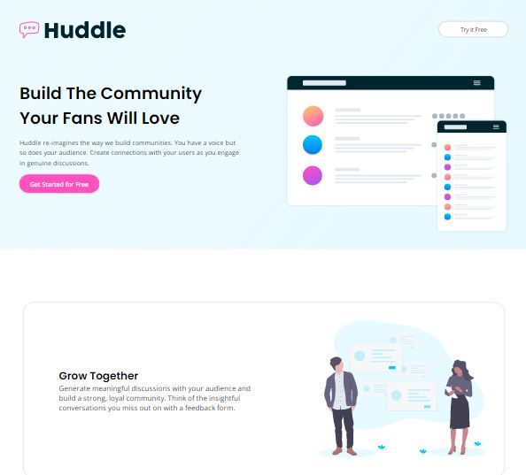
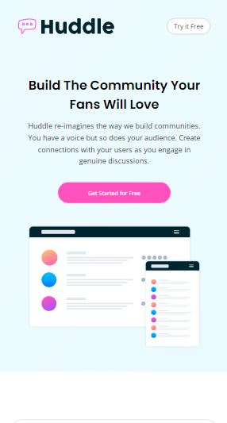

# HUDDLE TASK DOCUMENTATION
The Huddle task helped me learn more about responsiveness, especially as it pertains to media queries and positioning on different devices

## LANGUAGES USED
* HTML
* CSS

## PROCESSES USED
* Media Queries
* Flexbox

---

## Screensot

## LIVE SITE
[Huddle Page](https://imrvon.github.io/huddle)

---
### RESOURCES
* Learned about media queries standard breakpoints from this [FreeCodeCamp](https://www.freecodecamp.org/news/css-media-queries-breakpoints-media-types-standard-resolutions-and-more/) article.
* The difference between max-width and width was clarified in this [Tutorial by Kevin Powell](https://courses.kevinpowell.co/view/courses/conquering-responsive-layouts/257597-day-6-review/740862-a-tale-of-width-and-max-width). It's free.
* Got all my icons from [Icon Finder](https://www.iconfinder.com/), of course.

### WHAT'S NEW
* Learned more about positioning using the absolute, left, right and top or bottom tags